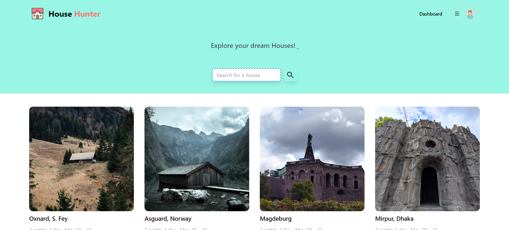
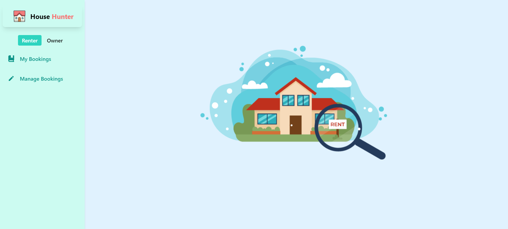

# House Hunter

A simple responsive house renting platform built using the MERN stack.

### HomePage Screenshot



### Dashboard Screenshot



### Technologies Used

[](https://skillicons.dev)

### React Libraries Used

- react-router, tanstack-query, axios, lottie-react, react-icons, react-simple-typewriter.

## Getting Started

Follow these steps to clone and run the project on your local machine.

Clone the repository and navigate to the cloned folder (client/server).

#### Install Dependencies

```bash
npm install
```

#### Configure Environment Variables

If you need the environment variables, contact me.

#### Run the Project

After configuring the environment variables, run these commands to start the project.

```bash
# CLIENT
cd client
npm run dev

# SERVER
cd server
nodemon index.js
```

### Features & Functionalities

- View and search for all available houses according to your needs
- Personalized dashboard for House Renter and Owner

### Client Side Live Link

[Netlify](https://papaya-trifle-9a61bd.netlify.app/) : https://papaya-trifle-9a61bd.netlify.app/
